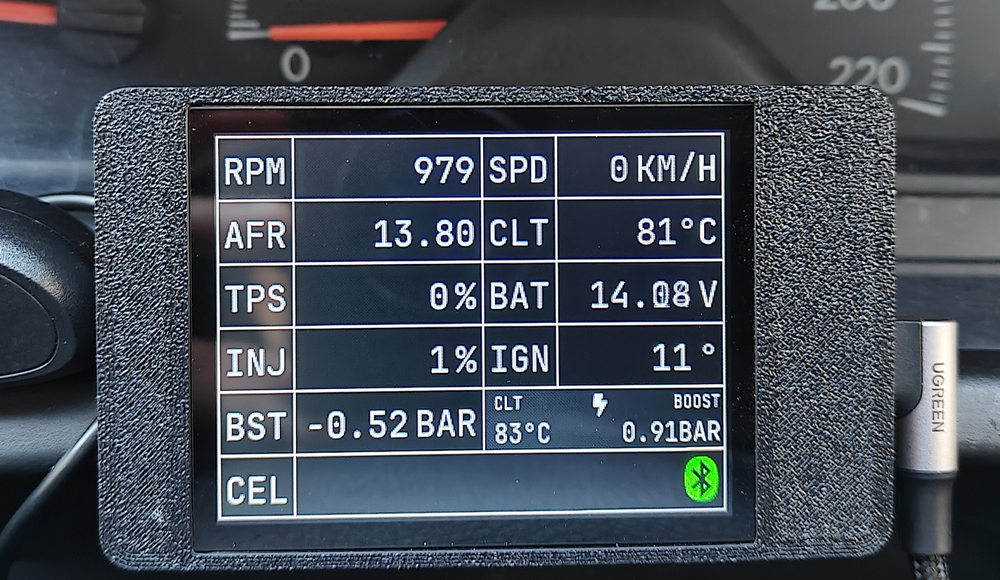

# 🚗 ECUMaster Black + ESP32 Bluetooth Display & Logger

---

## 📦 Description

This project interfaces the **ECUMaster Black ECU** with an **ESP32** to create a Bluetooth-enabled dashboard display, featuring:

* Automatic Bluetooth reconnection
* Real-time monitoring of engine vitals
* **Peak value tracking (Peak Boost & Peak Coolant Temperature)**
* Custom alerts (CEL, coolant temp, RPM, AFR, voltage, boost, etc.) via display & buzzer
* TFT screen GUI (mono-space font) with **LVGL**
* **Online Log Analyzer (mobile friendly)**
* **Automatic on-device logging to microSD card** 🆕

> ⚠️ **Note:** If `SerialBT.setPin(pin)` doesn't work, downgrade to **ESP32 Arduino Core 2.0.17** in the board manager.

---

## 🆕 New Functionality – microSD Logging & Bluetooth Stability

### 📀 Automatic microSD Log Recording

The ESP32 can now record ECU data **directly to a microSD card** without user interaction.

**How it works:**

* Logging starts automatically on **engine start / ECU connection**
* A **new CSV log file is created for each engine start**
* Logs are compatible with the included **Online Log Analyzer**
* Designed for long-term use without manual cleanup

**Storage management:**

* Available free space is continuously monitored
* When free space drops below **100 MB**, the **oldest log file is automatically deleted**
* Ensures logging never stops due to a full card

> 💡 Ideal for daily driving, tuning sessions, and track days without needing a laptop.

---

### 🔒 Bluetooth Data Validation (Stability Fix)

Bluetooth data handling has been improved to prevent crashes caused by incomplete or corrupted packets.

* Incoming BT data is **validated and sanitized** before parsing
* Partial or malformed frames are safely discarded
* Prevents random freezes or reboots during high data throughput

> ✅ Especially important when Bluetooth signal quality is poor or reconnecting mid-stream.

---

## 🆕 Peak Value Display & Log Analyzer

The display tracks and shows:

* **Peak Boost Pressure**
* **Peak Coolant Temperature (CLT)**

These values represent the **highest recorded readings since power-on**, allowing quick review after spirited driving or testing without logging software.

> 💡 Useful for tuning, safety checks, and track sessions.

### 🌐 Online Log Analyzer

* **No-install, browser-based CSV log viewer**
* **Stacked ECU channels with synced hover cursor**
* **Quick channel toggling for tuning & diagnostics**
* Mobile & tablet friendly

---

## ✅ Tested On

* ESP32 JC2432W328
* Active 3.3V buzzer
* Arduino Core v2.0.17
* ECUMaster Black with Bluetooth Adapter
* LVGL v8.3
* 8GB microSD card (FAT32)

---

## 📥 Installation

1. Clone this repo
2. Install dependencies (LVGL, TFT_eSPI, BluetoothSerial, SD)
3. Edit LVGL and TFT_eSPI config if needed
4. Edit the code – set ECU Bluetooth MAC **or** device name & PIN
5. Copy mono-space fonts (`ui_font_JBM_18.c`, `ui_font_JBM_15.c`, `ui_font_JBM_10.c`) to the project directory
6. Insert a FAT32-formatted microSD card
7. Upload to ESP32
8. *(Optional)* Connect an active 3.0–3.3V buzzer to GPIO **22**
9. Pair with ECUMaster Black Bluetooth adapter
10. Logs are recorded automatically – just drive 🚗

---

## 📦 Dependencies

* [BluetoothSerial](https://github.com/espressif/arduino-esp32/tree/master/libraries/BluetoothSerial)
* [LVGL](https://lvgl.io)
* [TFT_eSPI](https://github.com/Bodmer/TFT_eSPI)
* [SPI](https://docs.arduino.cc/learn/communication/spi/)
* [SD](https://docs.arduino.cc/libraries/sd/)

---

## 🔍 Log Analyzer (Web)

👉 **Launch Log Analyzer**
[https://danuecumaster.github.io/ECUMaster-Black-ESP32-Bluetooth-Display/log_analyzer/](https://danuecumaster.github.io/ECUMaster-Black-ESP32-Bluetooth-Display/log_analyzer/)

Features:

* Browser-based CSV viewer
* Multi-channel stacked graphs (MAP, RPM, TPS, AFR, IGN, INJ, CLT, SPD)
* Synchronized hover cursor across channels
* Toggle channels on/off
* Mobile-friendly layout

---

## ❓ FAQ

**Q:** SerialBT.setPin() doesn't work?
**A:** Use ESP32 Arduino Core v2.0.17. Later versions removed this feature.

**Q:** Logs not recording?
**A:** Check microSD wiring, FAT32 format, and SPI pin configuration.

**Q:** Display not initializing?
**A:** Check TFT_eSPI & LVGL configuration.

**Q:** Blurry text?
**A:** Verify `LV_COLOR_16_SWAP` in `lv_conf.h`.

**Q:** 3D printing material?
**A:** ABS or ASA recommended for high cabin temperatures.

---

## 🧰 Hardware Used

* **ESP32 JC2432W328**
  [https://www.aliexpress.com/item/1005006729707613.html](https://www.aliexpress.com/item/1005006729707613.html)
* **3D Printed Case**
  [https://www.thingiverse.com/thing:6705691](https://www.thingiverse.com/thing:6705691)
* **ECU**
  ECUMaster Black + Bluetooth Adapter
* **Active 3.3V buzzer**
  [https://www.aliexpress.com/item/1005008682347898.html](https://www.aliexpress.com/item/1005008682347898.html)

---

## 📺 Demo

[https://youtu.be/EzVEeiy3vmI](https://youtu.be/EzVEeiy3vmI)

---

## 📜 License

Licensed under **GPL v3**. See `LICENSE` for details.

---

## ❤️ Credits & Contributions

Made with ❤️ for petrolheads.
Forks, pull requests, and feature requests are welcome.
